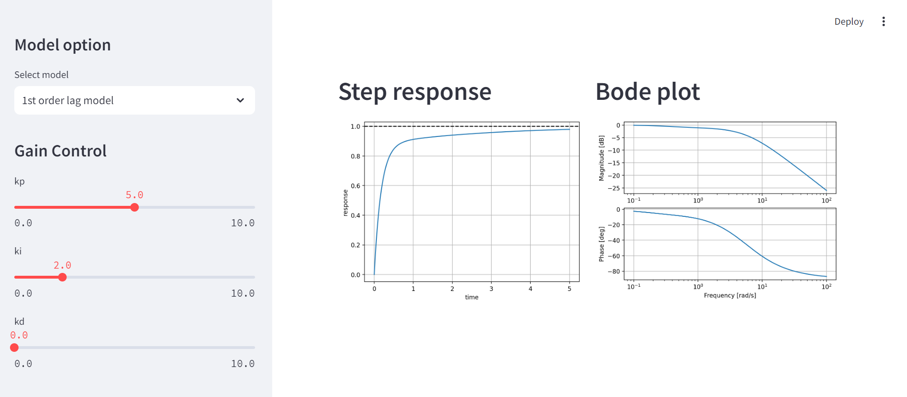

# PID-Control-GUI
This is web app for PID-Control. We can select model and adjust each of gain and then we can see response and bode plot.

Here is the image of this app.


## How to run app
### Local
- Install [poetry](https://github.com/python-poetry/poetry)
```bash
pip install poetry
```

- Update poetry config
```bash
poetry config virtualenvs.in-project true
```

- Install dependencies
```bash
poetry install --no-root
```

- Run app
```bash
poetry run task start
```

- Open http://localhost:8501/

### Docker
- Run app
```bash
docker compose up -d
```

- Open http://localhost:8501/

## License
Licensed under the [MIT License](https://github.com/uyouid/PID-Control-GUI/blob/main/LICENSE).
